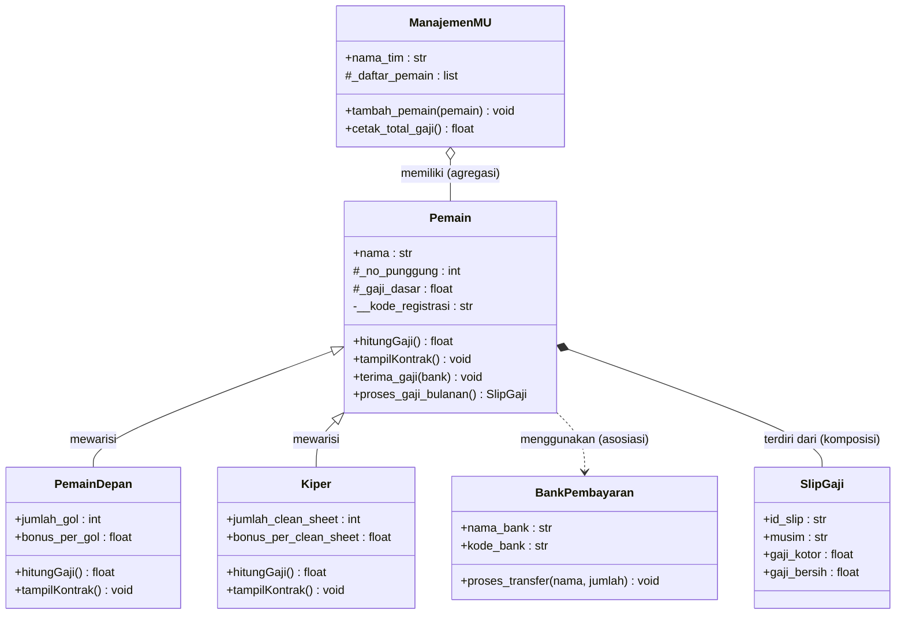

# GGMU — Governance Gaji Manchester United

Posttest Pemrograman Berorientasi Objek. Tema ini sudah di-ACC aslab kelas.
Posttest kali ini fokus pada dua materi: **Relasi UML (Modul 4)** dan **Inheritance (Modul 5)**.

## Cara Menjalankan

```bash
python3 ggmu_governance_gaji_mu.py
```

Seluruh pengujian (instansiasi objek, overriding, validasi setter, dsb) ada di blok
`if __name__ == "__main__":` di bagian bawah file, dibagi jadi 10 bagian DEMO yang tercetak
berurutan saat program dijalankan.

## Daftar Class

| Class | Peran |
|---|---|
| `Pemain` | Superclass. Data umum pemain (nama, no. punggung, gaji dasar). |
| `PemainDepan` | Subclass `Pemain`. Tambahan: `jumlah_gol`. |
| `Kiper` | Subclass `Pemain`. Tambahan: `jumlah_clean_sheet`. |
| `ManajemenMU` | Mengelola skuad — contoh **Agregasi**. |
| `BankPembayaran` | Memproses transfer gaji — contoh **Asosiasi**. |
| `SlipGaji` | Catatan gaji bulanan — contoh **Komposisi**. |

## Diagram UML



Notasi mengikuti yang diajarkan di Modul 4 & 5: `<|--` pewarisan, `o--` agregasi,
`*--` komposisi, `..>` asosiasi/dependensi. Tanda `+` public, `#` protected, `-` private.

## 1. Relasi UML

### Asosiasi — `Pemain` "menggunakan" `BankPembayaran`
`BankPembayaran` tidak pernah disimpan sebagai atribut tetap di `Pemain`. Objek ini hanya
diterima sebagai parameter method `terima_gaji(self, bank)`, dipakai sesaat untuk memproses
transfer, lalu dilepas. Kedua objek (`Pemain` dan `BankPembayaran`) tetap bisa hidup mandiri
satu sama lain.

```python
def terima_gaji(self, bank):
    gaji = self.hitungGaji()
    bank.proses_transfer(self.nama, gaji)
```

### Agregasi — `ManajemenMU` "memiliki" banyak `Pemain`
Objek `Pemain` dibuat **di luar** `ManajemenMU`, lalu didaftarkan lewat method
`tambah_pemain(pemain)`. Kepemilikannya tidak eksklusif — satu objek `Pemain` bisa saja
terdaftar di skuad lain, dan kalau objek `ManajemenMU`-nya dihapus (`del`), objek `Pemain`
di dalamnya **tetap hidup**. Ini dibuktikan di DEMO 9: `skuad_u21` dihapus, tapi `depan3`
tetap bisa dipanggil `tampilKontrak()`-nya.

### Komposisi — `Pemain` "terdiri dari" `SlipGaji`
Objek `SlipGaji` dibuat **langsung di dalam** method `proses_gaji_bulanan()` milik `Pemain`,
dan hanya disimpan di `self._riwayat_slip` milik instance tersebut. Siklus hidupnya menempel
penuh ke `Pemain` pemiliknya — kalau objek `Pemain`-nya dihapus, seluruh riwayat slip
gajinya ikut musnah karena tidak direferensikan di tempat lain. Dibuktikan di DEMO 10.

## 2. Inheritance

- **Superclass**: `Pemain`. **Subclass** (minimal 2): `PemainDepan`, `Kiper`.
- **`super().__init__()`**: dipakai di constructor kedua subclass untuk mengisi atribut dasar
  (`nama`, `no_punggung`, `gaji_dasar`) tanpa menulis ulang logika `Pemain.__init__`.
- **Atribut tambahan tiap subclass**: `PemainDepan.jumlah_gol`, `Kiper.jumlah_clean_sheet`.
- **Method overriding**: `hitungGaji()` dan `tampilKontrak()` di-override di kedua subclass.
  - `hitungGaji()` beda rumus: `PemainDepan` pakai bonus per gol, `Kiper` pakai bonus per
    clean sheet.
  - `tampilKontrak()` di subclass memanggil `super().tampilKontrak()` dulu (reuse logika
    parent), baru menambahkan baris statistik spesifiknya sendiri.
- **Protected vs Private**:
  - `_gaji_dasar` dan `_no_punggung` dibuat **protected** (garis bawah satu) karena memang
    perlu dibaca langsung oleh subclass — lihat `hitungGaji()` di `PemainDepan`/`Kiper` yang
    langsung memakai `self._gaji_dasar`.
  - `__kode_registrasi` dibuat **private** (garis bawah dua) karena benar-benar rahasia
    internal milik `Pemain`, hanya diekspos lewat getter `kode_registrasi` (read-only, tanpa
    setter).

## Fitur Lain (lanjutan dari posttest sebelumnya)

- Atribut kelas (≥3): `nama_klub`, `musim_liga`, `pajak_gaji`, `total_pemain`.
- Getter & setter idiomatis (`@property` / `@x.setter`) untuk `no_punggung` dan `gaji_dasar`,
  lengkap dengan validasi (angka tidak boleh negatif / di luar rentang 1-99).
- Class method: `ubah_pajak_gaji()` (ubah atribut kelas), `dari_dict()` (factory method) di
  tiap subclass.
- Static method: `validasi_no_punggung()`, `format_rupiah()`.